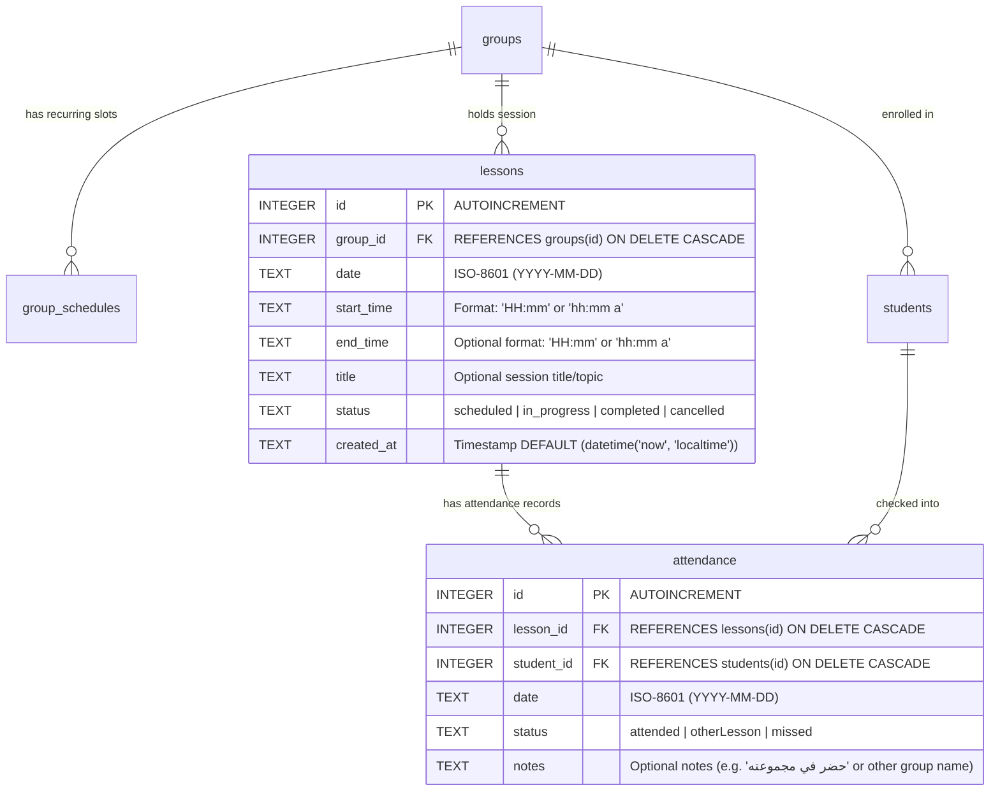
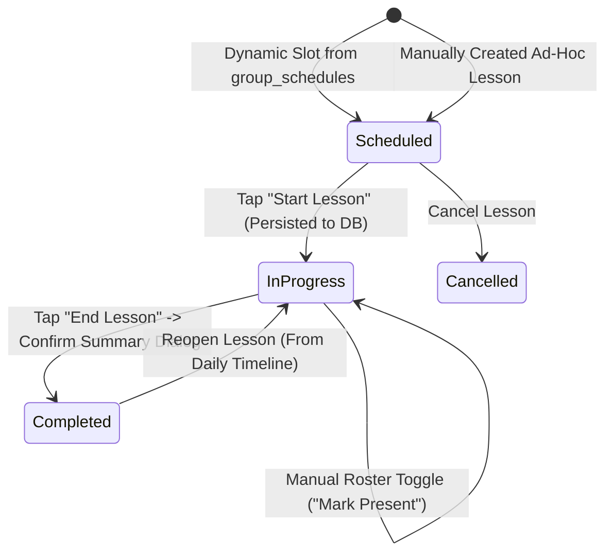

# Data Model: Lesson-Based Attendance System

**Feature**: `004-lesson-based-attendance`  
**Date**: 2026-08-25  
**Spec**: [spec.md](file:///c:/Projects/student_management_system/specs/004-lesson-based-attendance/spec.md)

---

## 1. Relational Database Schema (SQLite / SQLCipher)



### Table Definitions (DDL)

```sql
-- Lessons Table
CREATE TABLE IF NOT EXISTS lessons (
  id INTEGER PRIMARY KEY AUTOINCREMENT,
  group_id INTEGER NOT NULL,
  date TEXT NOT NULL,
  start_time TEXT NOT NULL,
  end_time TEXT,
  title TEXT NOT NULL DEFAULT '',
  status TEXT NOT NULL DEFAULT 'scheduled',
  created_at TEXT NOT NULL DEFAULT (datetime('now', 'localtime')),
  FOREIGN KEY (group_id) REFERENCES groups(id) ON DELETE CASCADE
);

-- Indexes for Lessons
CREATE INDEX IF NOT EXISTS idx_lessons_group ON lessons(group_id);
CREATE INDEX IF NOT EXISTS idx_lessons_date ON lessons(date);
CREATE INDEX IF NOT EXISTS idx_lessons_status ON lessons(status);

-- Alter attendance table (Migration for existing databases)
-- Note: executed via DatabaseService migration runner
ALTER TABLE attendance ADD COLUMN lesson_id INTEGER REFERENCES lessons(id) ON DELETE CASCADE;
CREATE INDEX IF NOT EXISTS idx_attendance_lesson ON attendance(lesson_id);
```

---

## 2. Dart Data Models (Freezed)

### Lesson Model (`lib/features/attendance/models/lesson.dart`)

```dart
import 'package:freezed_annotation/freezed_annotation.dart';

part 'lesson.freezed.dart';
part 'lesson.g.dart';

enum LessonStatus {
  scheduled,
  inProgress,
  completed,
  cancelled,
}

@freezed
abstract class Lesson with _$Lesson {
  const factory Lesson({
    int? id,
    required int groupId,
    required String date, // 'YYYY-MM-DD'
    required String startTime,
    String? endTime,
    @Default('') String title,
    @Default(LessonStatus.scheduled) LessonStatus status,
    String? groupName,
    int? enrolledCount,
    int? attendedCount,
    int? absentCount,
    DateTime? createdAt,
  }) = _Lesson;

  factory Lesson.fromJson(Map<String, dynamic> json) => _$LessonFromJson(json);
}
```

### Updated Attendance Model (`lib/features/attendance/models/attendance.dart`)

```dart
import 'package:freezed_annotation/freezed_annotation.dart';

part 'attendance.freezed.dart';
part 'attendance.g.dart';

enum AttendanceStatus {
  attended,
  missed,
  otherLesson,
}

@freezed
abstract class Attendance with _$Attendance {
  const factory Attendance({
    int? id,
    int? lessonId,
    required int studentId,
    required DateTime date,
    required AttendanceStatus status,
    @Default('') String notes,
    String? studentName,
    String? serialNumber,
    String? groupName,
  }) = _Attendance;

  factory Attendance.fromJson(Map<String, dynamic> json) =>
      _$AttendanceFromJson(json);
}
```

---

## 3. State Lifecycle & Transitions



### Transition Invariants
1. **Starting Lesson (`Scheduled -> InProgress`)**:
   - A `lessons` row is inserted into SQLite with `status = 'in_progress'`.
   - The scanner is locked to `activeLessonId`.
2. **Scanning Attendance**:
   - Condition: `student_id` not already in `attendance` WHERE `lesson_id = activeLessonId`.
   - If student's `group_id == lesson.group_id` $\rightarrow$ `status = 'attended'`.
   - If student's `group_id != lesson.group_id` (or null) $\rightarrow$ `status = 'otherLesson'` with note `"حضر في مجموعة [Active Group]"`.
3. **Ending Lesson (`InProgress -> Completed`)**:
   - Summary Dialog calculates:
     - `Present = count(status IN ('attended', 'otherLesson'))`
     - `Absent = enrolled_count - count(status = 'attended')`
   - On confirmation, DB updates `lessons SET status = 'completed' WHERE id = activeLessonId`.
