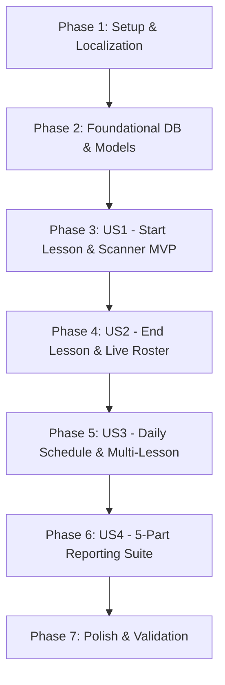

# Tasks: Lesson-Based Attendance System

**Input**: Design documents from [`specs/004-lesson-based-attendance/`](file:///c:/Projects/student_management_system/specs/004-lesson-based-attendance/)  
**Prerequisites**: [`plan.md`](file:///c:/Projects/student_management_system/specs/004-lesson-based-attendance/plan.md), [`spec.md`](file:///c:/Projects/student_management_system/specs/004-lesson-based-attendance/spec.md), [`data-model.md`](file:///c:/Projects/student_management_system/specs/004-lesson-based-attendance/data-model.md), [`contracts/`](file:///c:/Projects/student_management_system/specs/004-lesson-based-attendance/contracts/), [`quickstart.md`](file:///c:/Projects/student_management_system/specs/004-lesson-based-attendance/quickstart.md)

---

## Format: `[ID] [P?] [Story] Description`

- **[P]**: Can run in parallel (different files, no dependencies)
- **[Story]**: Which user story this task belongs to (`US1`, `US2`, `US3`, `US4`)
- Exact file paths included in all descriptions

---

## Phase 1: Setup & Localization

**Purpose**: Update Arabic and English localization dictionaries for new lesson-based terminology and report labels.

- [X] T001 [P] Add lesson-based attendance translation keys to `assets/translations/en.json`
- [X] T002 [P] Add lesson-based attendance translation keys to `assets/translations/ar.json`
- [X] T003 Run `easy_localization` code generation to update `lib/generated/locale_keys.g.dart` and `lib/generated/codegen_loader.g.dart`

---

## Phase 2: Foundational (Database & Data Models)

**Purpose**: Core database schema migration and Freezed data models required across all user stories.

**⚠️ CRITICAL**: Must be completed before user story implementation.

- [X] T004 [P] Create `Lesson` Freezed model in `lib/features/attendance/models/lesson.dart`
- [X] T005 [P] Update `Attendance` model with `lessonId`, `groupName`, and `serialNumber` in `lib/features/attendance/models/attendance.dart`
- [X] T006 Update `DBQueries` with `createLessonsTable`, `alterAttendanceAddLessonId`, lesson index DDL, lesson queries, and reporting queries in `lib/app/constants/db_queries.dart`
- [X] T007 Update `DatabaseService` to create `lessons` table, apply indexes, and execute historical legacy attendance migration in `lib/app/services/database_service.dart`

**Checkpoint**: Database schema and models ready.

---

## Phase 3: User Story 1 - Start Lesson Session & QR Attendance Scanning (Priority: P1) 🎯 MVP

**Goal**: Enable teachers to initiate a lesson session for a specific group, locking the scanner to that active session with duplicate prevention and automatic enrolled vs. other-group detection.

**Independent Test**: Start a lesson session for Group A, scan a student from Group A (recorded as "Attended in Group"), scan a student from Group B (recorded as "Other Lesson"), and re-scan Group A student (duplicate prevented).

- [X] T008 [P] [US1] Implement `LessonCubit` and `LessonState` in `lib/features/attendance/cubits/lesson_cubit.dart` for loading daily schedules and managing `startLesson` / `activeLesson`
- [X] T009 [US1] Update `AttendanceCubit` in `lib/features/attendance/cubits/attendance_cubit.dart` to link attendance to `activeLesson.id`, validate duplicates per lesson, and categorize `attended` vs. `otherLesson`
- [X] T010 [P] [US1] Create `ActiveLessonBanner` widget in `lib/features/attendance/screens/qr_scanner/components/active_lesson_banner.dart` displaying group name, schedule time, and live attendance counter
- [X] T011 [US1] Update `QrScannerScreen` in `lib/features/attendance/screens/qr_scanner/qr_scanner_screen.dart` to embed `ActiveLessonBanner`, listen to `LessonCubit`, and lock scanning to active session

**Checkpoint**: User Story 1 functional and independently testable as an MVP.

---

## Phase 4: User Story 2 - End Lesson Session & Live Roster / Absentee Review (Priority: P2)

**Goal**: Provide a live roster of attended vs. absent students during the lesson with 1-tap manual present toggle, and present a summary confirmation dialog upon tapping "End Lesson".

**Independent Test**: Open an ongoing lesson with enrolled students, view absent students in the "Absent" tab, tap "Mark Present" on one student, tap "End Lesson", verify totals in the Summary Dialog, and confirm session completion.

- [X] T012 [P] [US2] Create `LiveRosterView` in `lib/features/attendance/screens/qr_scanner/components/live_roster_view.dart` with "Attended" and "Absent" tabs and 1-tap "Mark Present" button
- [X] T013 [P] [US2] Create `EndLessonDialog` in `lib/features/attendance/screens/qr_scanner/components/end_lesson_dialog.dart` showing present, other group, absent counts, and confirmation button
- [X] T014 [US2] Integrate `LiveRosterView` and `EndLessonDialog` into `QrScannerScreen` in `lib/features/attendance/screens/qr_scanner/qr_scanner_screen.dart` and wire to `LessonCubit.endLesson`

**Checkpoint**: User Stories 1 & 2 fully functional together.

---

## Phase 5: User Story 3 - Daily Lessons Schedule & Multi-Lesson Support (Priority: P3)

**Goal**: Display all scheduled lessons for any selected date, allow ad-hoc lesson creation/editing, and allow students to attend multiple distinct lessons on the same date.

**Independent Test**: Navigate to Attendance list, change dates, view dynamically computed group lessons alongside started lessons, add an ad-hoc revision lesson, and verify attendance records for multiple lessons on the same day.

- [X] T015 [P] [US3] Create `LessonCard` in `lib/features/attendance/screens/attendance_list/components/lesson_card.dart` showing session time, group name, status badge, attendee counts, and Start/Resume/Reopen actions
- [X] T016 [P] [US3] Create `AddLessonDialog` in `lib/features/attendance/screens/attendance_list/components/add_lesson_dialog.dart` to add ad-hoc revision/make-up sessions
- [X] T017 [US3] Update `AttendanceListScreen` in `lib/features/attendance/screens/attendance_list/attendance_list_screen.dart` with date navigation bar, daily lesson list, and ad-hoc creation button
- [X] T018 [US3] Update `AttendanceTab` in `lib/features/students/screens/student_detail/tabs/attendance_tab.dart` to display lesson time, group name, and session status per attendance entry

**Checkpoint**: User Stories 1, 2, and 3 fully functional.

---

## Phase 6: User Story 4 - Comprehensive Lesson & Absentee Reporting Suite (Priority: P4)

**Goal**: Deliver the 5-part reporting engine: Per-Lesson PDF Report, Absentee Follow-Up Phone Sheet, Group Multi-Lesson Summary, updated Student Profile Report, and CSV Export.

**Independent Test**: Generate a Per-Lesson PDF, generate an Absentee Phone Sheet for a group, generate a Group Summary PDF, and export attendance to CSV with lesson columns.

- [X] T019 [US4] Implement `generateLessonSessionReport`, `generateAbsenteeFollowUpReport`, and `generateGroupAttendanceSummaryReport` in `lib/features/reports/cubits/report_cubit.dart`
- [X] T020 [US4] Update `generateStudentReport` in `lib/features/reports/cubits/report_cubit.dart` to include lesson-specific attendance entries and overall attendance rate %
- [X] T021 [P] [US4] Create `LessonAttendanceReportForm` in `lib/features/reports/screens/report/components/lesson_attendance_report_form.dart` with lesson/group/date filters
- [X] T022 [US4] Update `exportAttendanceCsv` in `lib/features/settings/services/backup_service.dart` with lesson date, time, and group columns
- [X] T023 [US4] Update `ReportScreen` in `lib/features/reports/screens/report/report_screen.dart` to expose lesson and absentee report options
- [X] T024 [P] [US4] Update CSV export service with lesson date, time, and group columns

**Checkpoint**: All 4 user stories and full reporting suite functional.

---

## Phase 7: Polish & Validation

**Purpose**: Code generation, static analysis, and end-to-end verification.

- [X] T025 [P] Run `dart run build_runner build --delete-conflicting-outputs` to generate all Freezed and JSON serialization files
- [X] T026 Run `flutter analyze` and resolve any static analysis warnings or lint errors
- [X] T027 Execute all verification scenarios and automated unit test suite

---

## Dependencies & Execution Order

### Parallel Opportunities

- **Phase 1**: T001 and T002 can run in parallel.
- **Phase 2**: T004 and T005 can run in parallel.
- **Phase 3 (US1)**: T008 (Cubit) and T010 (ActiveLessonBanner UI) can run in parallel.
- **Phase 4 (US2)**: T012 (LiveRosterView) and T013 (EndLessonDialog) can run in parallel.
- **Phase 5 (US3)**: T015 (LessonCard) and T016 (AddLessonDialog) can run in parallel.
- **Phase 6 (US4)**: T021 (AbsenteeReportForm) and T024 (CSV Export) can run in parallel.

---

## Implementation Strategy

### MVP First (User Story 1 Only)
1. Complete Phase 1 (Setup) + Phase 2 (Foundational DB & Models).
2. Complete Phase 3 (User Story 1).
3. **Validate MVP**: Test starting a lesson session and scanning QR codes with active session lock.

### Incremental Delivery
- Add Phase 4 (US2): Enable live absentee roster and End Lesson confirmation dialog.
- Add Phase 5 (US3): Enable daily calendar timeline, multi-lesson attendance, and ad-hoc classes.
- Add Phase 6 (US4): Enable complete 5-part reporting engine and CSV export.
- Run Phase 7: Final analysis and end-to-end verification.
